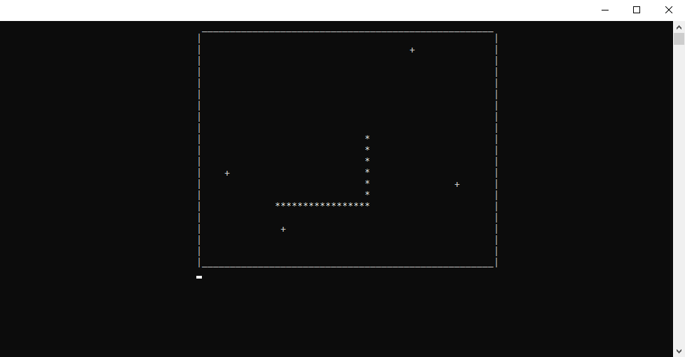

<h2 align="center">DISCLAIMER!</h2>

<h3 align="left">Read before compiling this code in your IDE</h3>

<h3 align="left">You have to be aware that this code can let the leak of memory to be
So be careful and check out my code. Maybe you'll be able to find
problems in my code which will help avoid the memory leak.</h3>

<h4 align="left">This code is working as a prototype.
It's not good at all and has bugs which should get fixed.</h4>
                
---

it looks like this:

---

Bugs which should be fixed:

- optimization of using std::vector in this code!!!
